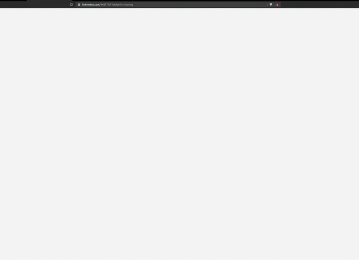

# shortlink-bot
A discord bot that bypasses links using node-fetch, and Eris.

# Support Server

[Click me!](https://discord.gg/YhkPFjrDjk)

# Invite
[Invite Shortlink Bot into your Discord!](https://discord.com/oauth2/authorize?client_id=780857188171644962&scope=bot&permissions=52224) The prefix is | (pipe).

# Demo

 (replace ?linkvertise with ?bypass)

# Credits
[Sainan/Universal-Bypass](https://github.com/Sainan/Universal-Bypass) for linkvertise.

# How does it work?
The bot sends a request to Linkvertise (https://publisher.linkvertise.com/api/v1/redirect/link/static/insert/linkvertise/path/here) and obtains the link id necessary to get the link.

Then, it sends another request to them (https://publisher.linkvertise.com/api/v1/redirect/link/insert/linkvertise/path/here/target?serial=base64encodedjson) to grab the link.

The linkvertise path is this part. (/respecting/linkvertise-bypass/)

An example of a serial is: 
`{"timestamp":1606260928, "random":"6548307", "link_id":31283553}`

The timestamp is the unix epoch, random isn't really random (always has to be 6548307) and link_id is the id we obtained from the first request.

# Usage
1. Clone this repository

2. `cd` into the repository.

3. `npm i` to install necessary dependencies.

4. Create a `.env` file and put the following in. 

```
token=
prefix=
```

5. Change prefix to whatever you like.

6. Add token.

7. `node index.js` to start running the bot.

8. Profit!

# Commands

`bypass [link]`

`help`
